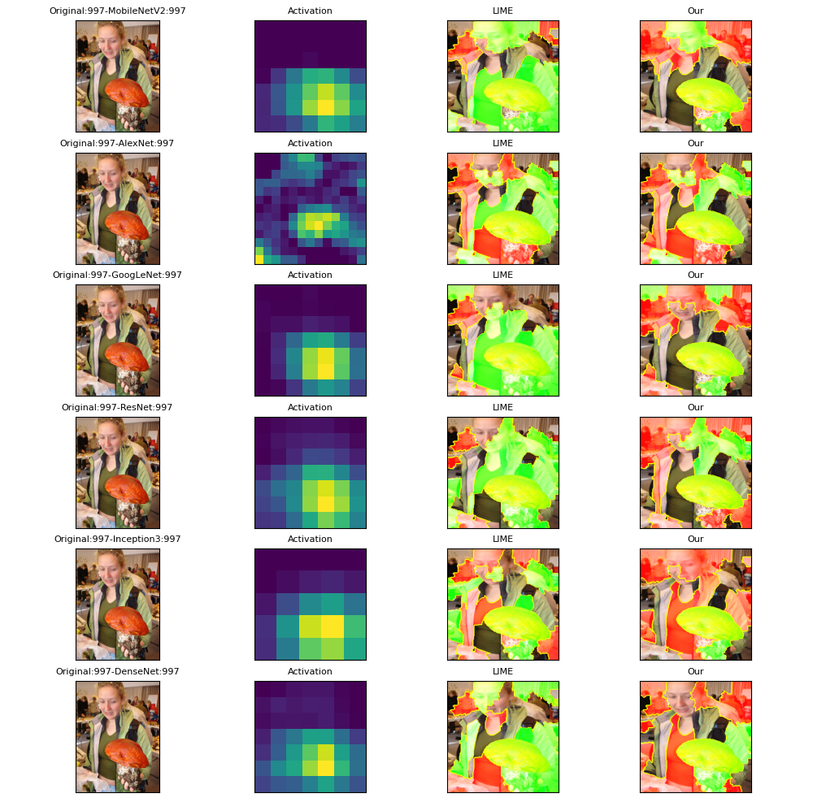

# GradLIME
GradLIME: A CNN Local Interpretation Model Based on Feature Gradient Activation1

This project provides complete experimental code, environment dependency configuration, and running process for academic replication and secondary research.

Paper Link£ [arXiv / IEEE / ACM / Springer link]  
Authors£ [Jinwei Zhao£¬zhaojinwei@xaut.edu.cn; Jiedong Liu,1041674453@qq.com; Xinhong Hei*£¬heixinhong@xaut.edu.cn]  
Affiliation£ [Xi'an University of Technology CN]

---


## GradLIME Interpretation Model

|         GradLIME Interpretation Model         |
|:-------------------------------:|
|  |


As deep learning technologies advance rapidly, there is a growing demand for greater transparency and reliability in neural
network decision-making. This demand has spurred progress in the explainability of Convolutional Neural Networks (CNNs) in
recent years, though significant challenges persist. Current explanation methods typically fall into two categories: those that
rely entirely on the internal feature information of neural networks to construct explanations and those that use model-agnostic
approaches based on visual concepts. The first approach faces limitations due to the highly abstract nature of the embedded
features within neural networks and their fundamental differences from human reasoning processes, leading to inevitable
deviations from human cognition. On the other hand, while model-agnostic methods can explore CNNs¡¯ computational logic
from a human-centric perspective, their independence from specific models makes it challenging to provide explanations
directly linked to the network¡¯s computational structure. In some cases, these explanations may even deviate from the true
underlying mechanisms of the model. To address these issues, this paper proposes a local explanation model based on
feature gradient activation for CNNs, called GradLIME, which is built upon the local interpretable model-agnostic explanations
(LIME) method. In the construction of the local linear explanation model, GradLIME incorporates feature gradient activation
data from multiple layers of the CNN, facilitating the generation of a comprehensible local linear explanation that also fully
utilises the embedded feature pertaining to the network¡¯s computational structure. Finally, experiments were conducted on
standard datasets to provide qualitative and quantitative evaluations of the local explanations generated by GradLIME. The
results demonstrate that, in comparison to numerous state-of-the-art explanation methods that provide visual explanations,
GradLIME is more effective at distinguishing between important and unimportant features, and at extracting accurate local
explanations that are easier for humans to understand in the context of CNN reasoning. 

---

## Environmental dependence

This project is developed using Python, and it is recommended to use Anaconda to set up a virtual environment.

### Create and activate a virtual environment

```bash
conda create -n GradLIME python=3.8
conda activate GradLIME
pip install -r requirements.txt
```

---

## Quick Start

### 1. Clone Repository

```bash
git clone https://github.com/LiuJiedong-Coder/GradLIME.git
cd GradLIME
```

### 2. Download Data

Place the dataset in the 'data/' directory.

```txt
Download and Processing of ImageNet2012 Dataset?https://blog.csdn.net/weixin_47160526/article/details/132037269
```

### 3. Run the Code

```bash
python GradLIME.py --image-path <path_to_image> --device cuda
```

### 4. Change Black Model

```txt

# Black box model and activation layer selection recommendation, with the number of model root parameters increasing from small to large
model_mob = models.mobilenet_v2(pretrained=True).eval().to(device)
model_alex = models.alexnet(pretrained=True).eval().to(device)
model_google = models.googlenet(pretrained=True).eval().to(device)
model_res18 = models.resnet18(pretrained=True).eval().to(device)
model1_inc = models.inception_v3(pretrained=True).eval().to(device)
model_dense = models.densenet121(pretrained=True).eval().to(device)
#model_vgg = models.vgg16(pretrained=True).eval().to(device)

target_layers_mob = [model_mob.features[17]]   #mobilenet
target_layers_alex = [model_alex.features[11]]   #alexnet
target_layers_google = [model_google.inception5b]   #googlenet
target_layers_res18 = [model_res18.layer4[-1]]   #resnet18,50
target_layers_inc = [model1_inc.Mixed_7c]   #inception_v3
target_layers_dense = [model_dense.features[-1]]  # vgg / densenet
#target_layers_vgg = [model_vgg.features[-1]]

```

---

## Faithfulness and Complexity Evaluation

Set parameters based on equipment conditions.

```bash
python MyFaithfulness.py --NumFile 1 --FileSample 50

python MyComplexity.py --NumFile 1 --FileSample 50
```

results will be saved in '/results'

---

## Partial Experimental Effect Display

| explanation of different black box models | feature gradient activation of different feature layers |
|--------|--------|
|  |  |

|   Feature versus weight plot   |
|:-------------------------------:|
|  |